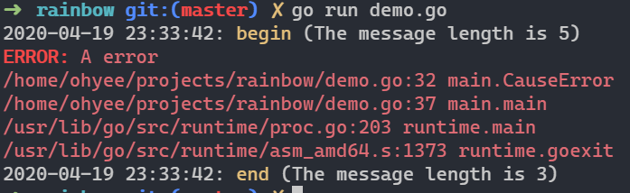

# rainbow'

   

Colorful go terminal output, and using it in log

[Document](https://pkg.go.dev/github.com/OhYee/rainbow?tab=overview)

This package has three sub-package:
- color: colorful output ([ANSI_escape_code](https://en.wikipedia.org/wiki/ANSI_escape_code))
- log: log with prefix, suffix and color
- errors: error with call stack

## DEMO
[demo.go](demo.go)

